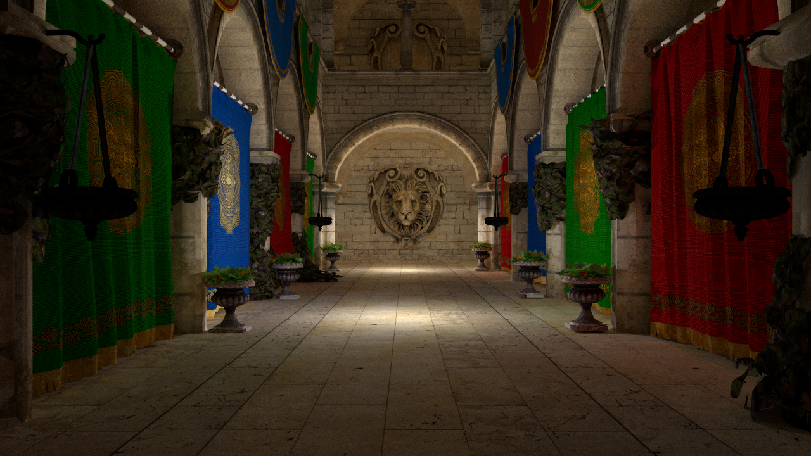
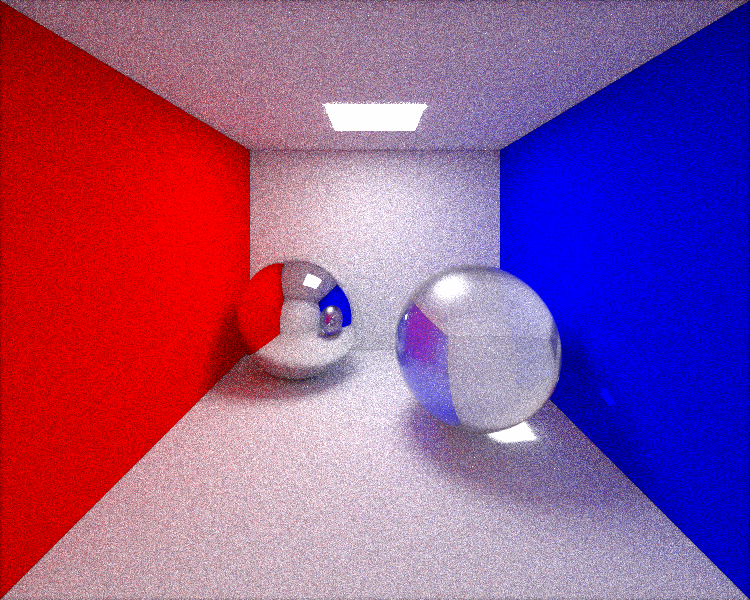
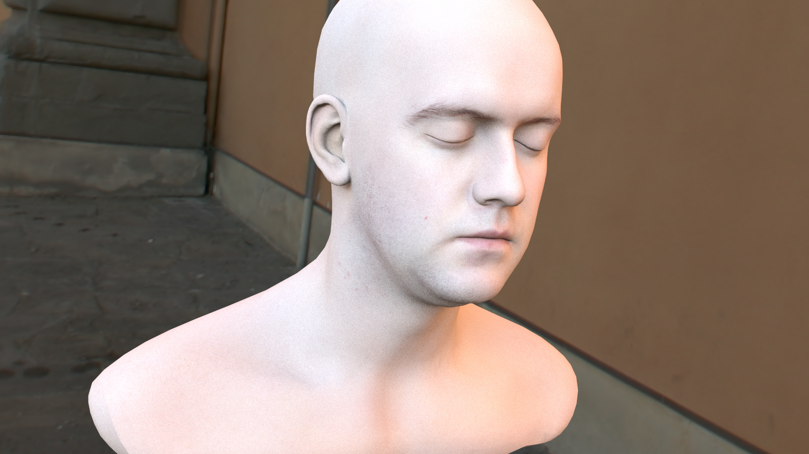
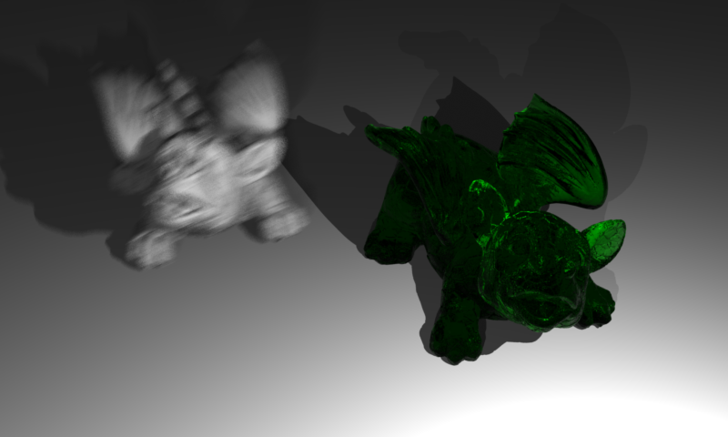
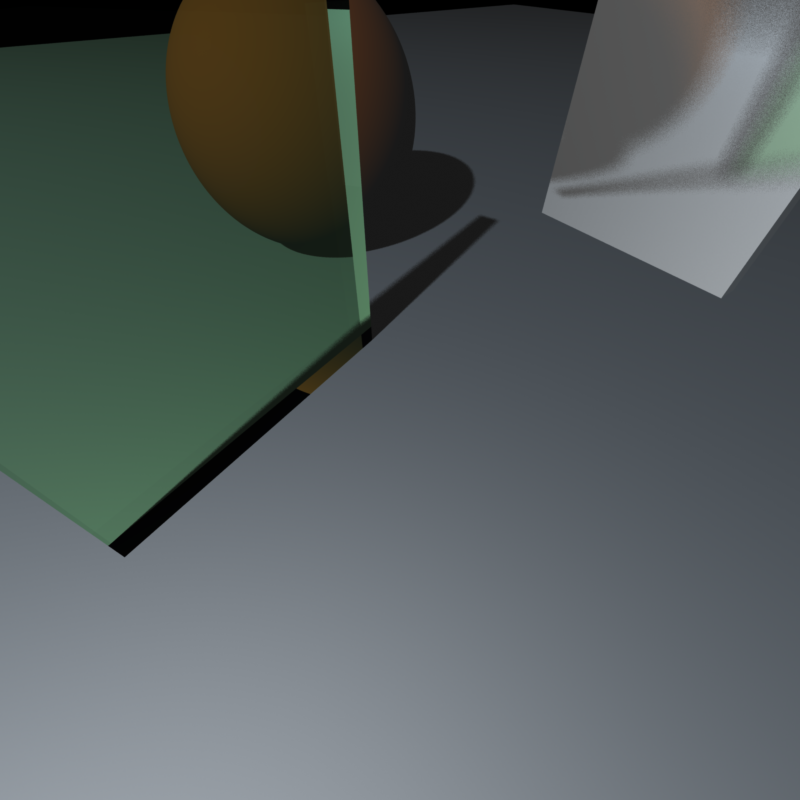

# azimuth

# Notes
* Check [devlog]( https://fukdemir.blogspot.com/ ) for details.
* Third-party libraries used (in this repository, OpenEXR and libxml are provided for x64 only): 
    * [OpenEXR](https://www.openexr.com/)
    * [libxml](http://xmlsoft.org/)
    * [stb_image](https://github.com/nothings/stb/blob/master/stb_image.h) and [stb_image_write](https://github.com/nothings/stb/blob/master/stb_image_write.h)
* Both scene format and its parser are a little bit janky. Sample scenes and assets will be provided after fixing them.
* Bidirectional path tracing will be re-implemented soon.

# Features
* Supported entity types: spheres, triangles or triangulated meshes
* Supported image formats: BMP, JPEG, PNG, TGA and EXR
* Supports point lights, directional lights, spot lights, area lights and entity lights (i.e. light emitting entities)
* Dielectric materials
* Motion blur
* Seven types of BRDF models
* Procedural textures using Perlin noise
* Bump mapping
* Environment mapping
* Reinhard tone mapping
* Gamma correction
* Path tracing with uniform sampling and importance sampling
* Box and Gaussian filtering to mix samples
* Backface culling
* Bounding Volume Hierarchies (BVHs) are used for acceleration
* Multithreading
* Profiler (supports only single-threaded runs, for now)
